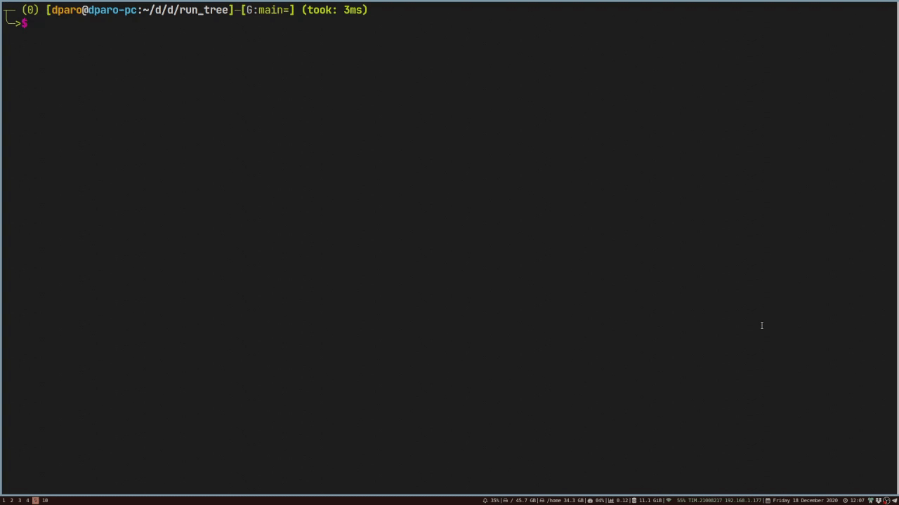

# dpcc: DParo's own C-alike Compiler frontend



## Docs

Read the project report [here](https://github.com/dparo/dpcc/releases/download/1.0.1/DPL_ProjectAssignmentReport.pdf).

For **more details** refer to the [Project Wiki](https://github.com/dparo/dpcc/wiki)


## Cloning

```sh
git clone --recursive https://github.com/dparo/dpcc
```
